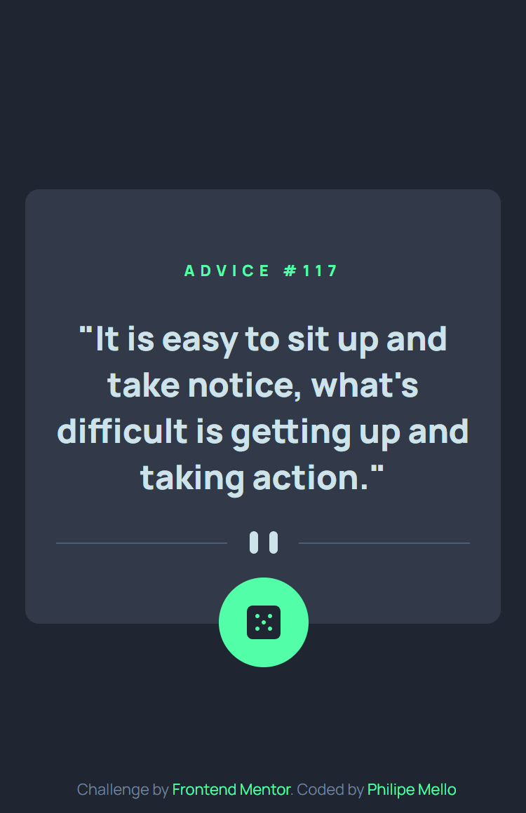
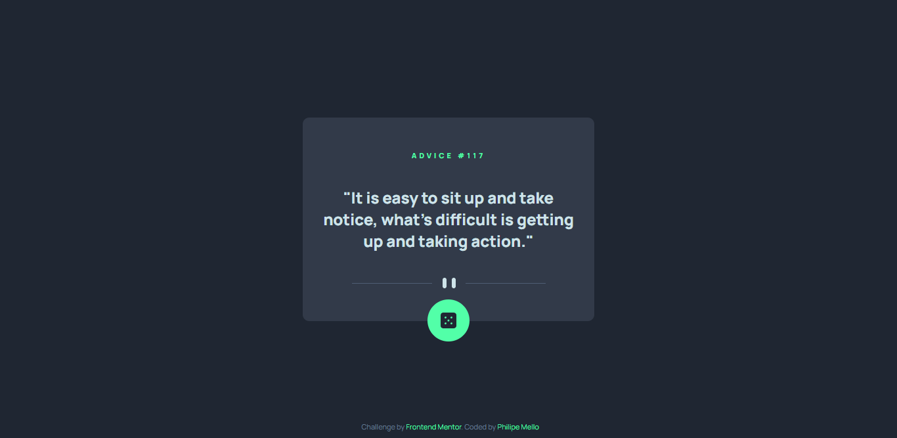
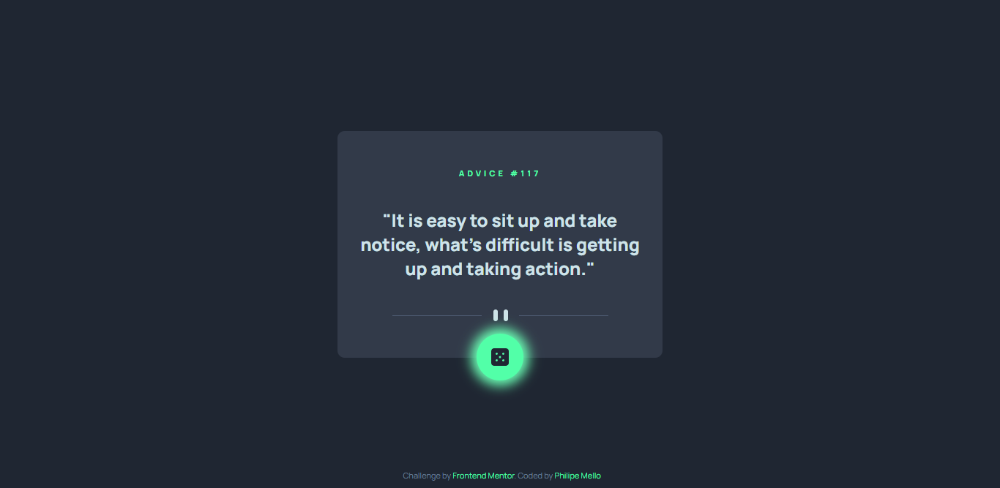

# Frontend Mentor - Advice generator app solution

This is a solution to the [Advice generator app challenge on Frontend Mentor](https://www.frontendmentor.io/challenges/advice-generator-app-QdUG-13db). Frontend Mentor challenges help you improve your coding skills by building realistic projects.

## Overview

### The challenge

Users should be able to:

- View the optimal layout for the app depending on their device's screen size
- See hover states for all interactive elements on the page
- Generate a new piece of advice by clicking the dice icon

### Screenshot

 - Mobile

 - Desktop

 - Active State

### Links

- Solution URL: [GitHub](https://github.com/Philipessj1/Advice-generator-app)
- Live Site URL: [GitHub Pages](https://philipessj1.github.io/Advice-generator-app/)

## My process

### Built with

- Semantic HTML5 markup
- CSS custom properties
- CSS Grid
- CSS FlexBox
- SCSS Variables
- SCSS Functions
- Mobile-first workflow
- JavaScript DOM
- API

## Author

- GitHub - [Philipe Mello](https://github.com/Philipessj1)
- Frontend Mentor - [@philipessj1](https://www.frontendmentor.io/profile/Philipessj1)
